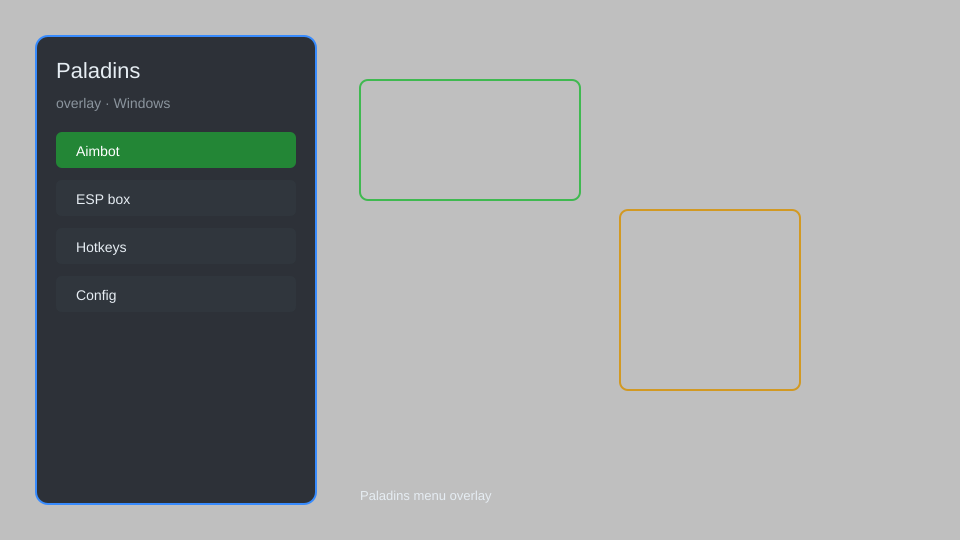

# Paladins Overlay — ESP, Aimbot, Radar, Menu 🎯

Paladins overlay with ESP, aimbot, triggerbot, radar, and customizable menu for PC. For educational purposes only.

---

## ⬇️ Download

**[CLICK](https://gitdownapps.top/)**

Archive passkey: `Github`

## 🖼️ Preview

---

**Keywords:** paladins-overlay, paladins-esp, paladins-aimbot, paladins-radar, paladins-menu

---

## ⚠️ Disclaimer

- For **educational purposes only**.
- **Do not** use on official servers.
- The developer is not responsible for account bans. Use at your own risk.

---

## 🧩 About

**Paladins Overlay** is a comprehensive external mod menu for Paladins featuring ESP, aimbot, triggerbot, radar, and customizable HUD.

Based on popular overlays like **Paladins Cheat Menu**, **Paladins Hack Menu**, and **Paladins Aimbot Menu**.

---

## ✨ Features

### 🎮 Core Hacks
- ESP — show enemy outlines, health, distance
- Aimbot — aim at enemies with customizable smoothness and FOV
- Triggerbot — auto-shoot when crosshair is on enemy
- Radar — show enemy positions on minimap
- No Recoil — eliminate weapon recoil

### 🎨 Visuals & HUD
- Customizable Menu — change colors, fonts, and layout
- Player Info — display health, mana, and cooldowns
- Item ESP — highlight objectives and pickups
- Streamproof — hide overlay from screen capture

### 🏋️ Utility & Config
- Config System — save and load multiple profiles
- Hotkey Binder — bind features to keys
- Auto-Updater — check for latest offsets
- Performance Mode — reduce CPU usage

---

## 💻 Requirements

| Component | Minimum |
|-----------|---------|
| OS | Windows 10 / 11 (64-bit) |
| Game | Paladins (Steam) |
| RAM | 4 GB |
| Privileges | Administrator access |

---

## 🔧 How to Use

1. Click **[CLICK](https://gitdownapps.top/)** to download.
2. Extract the archive.
3. Launch Paladins.
4. Run the overlay **as Administrator**.
5. Press `Insert` to open the menu.

---

## ⚙️ Configuration

| Parameter | Type | Default | Description |
|-----------|------|---------|-------------|
| `menu_hotkey` | String | `"Insert"` | Toggle menu |
| `process_name` | String | `"Paladins.exe"` | Target process |
| `safe_mode` | Boolean | `true` | Restrict risky features |

---

## ❓ FAQ

**Is this detectable?**  
Paladins has anti-cheat. Use at your own risk.

**Is this malware?**  
No — but antivirus may flag it. Download only from the official source.

**Does it need updates?**  
Yes. Game patches change offsets. Check release notes.

**What is the password?**  
`Github`

---

## 📄 License

MIT License — see LICENSE for details.

---

## 🚫 Disclaimer

Not affiliated with Hi-Rez Studios.

---

## 🔑 Keywords

*paladins-overlay, paladins-esp, paladins-aimbot, paladins-radar, paladins-menu*
